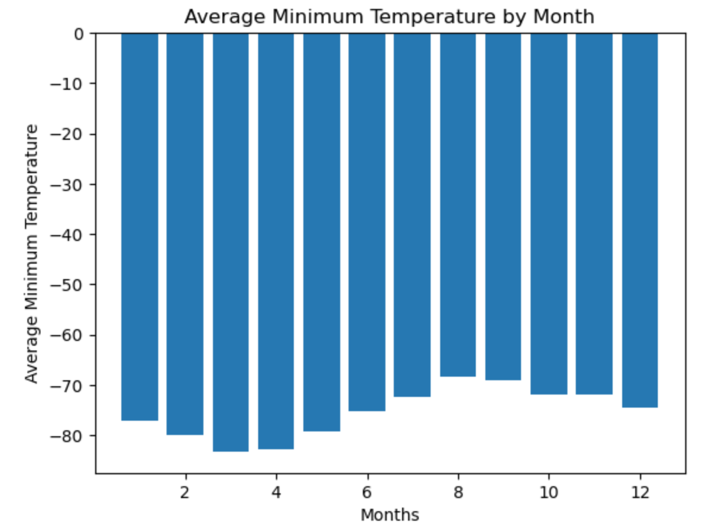
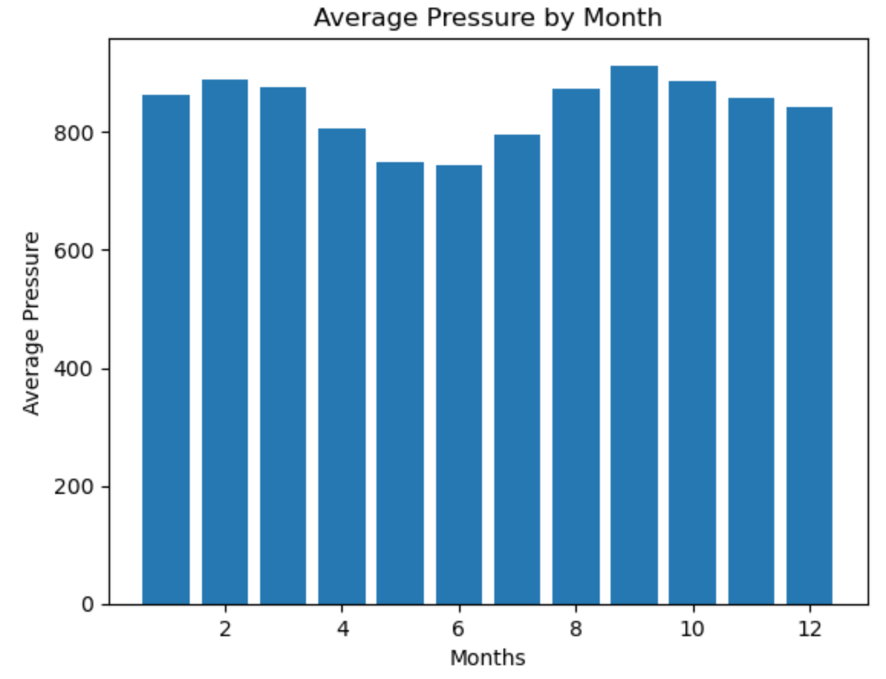
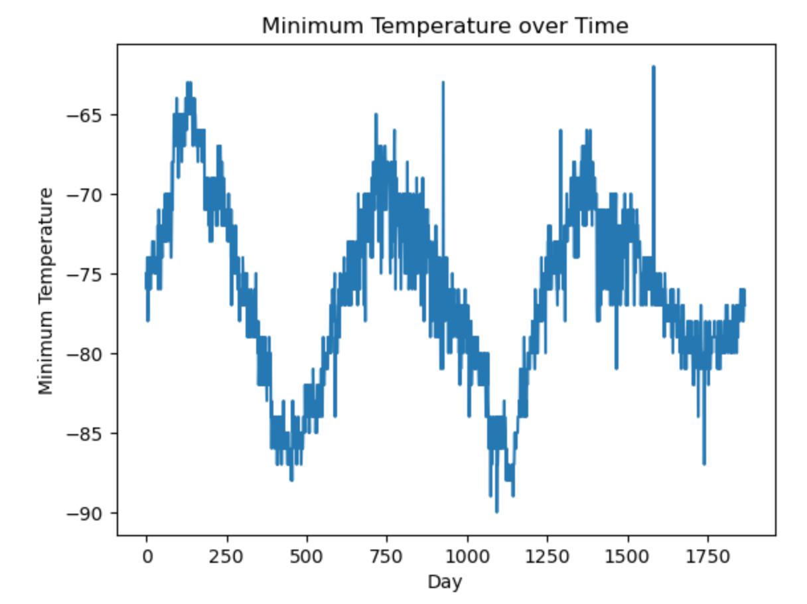
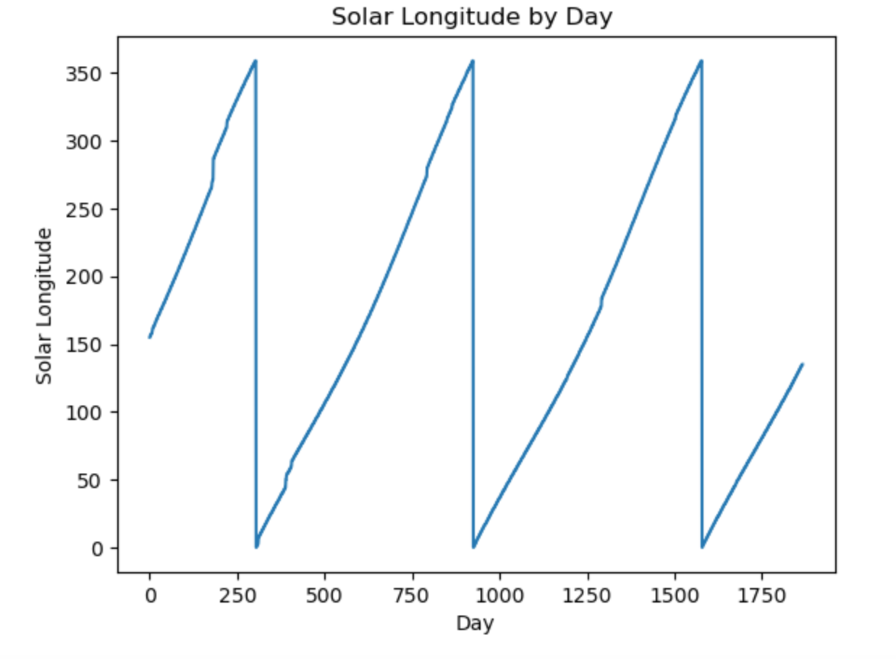
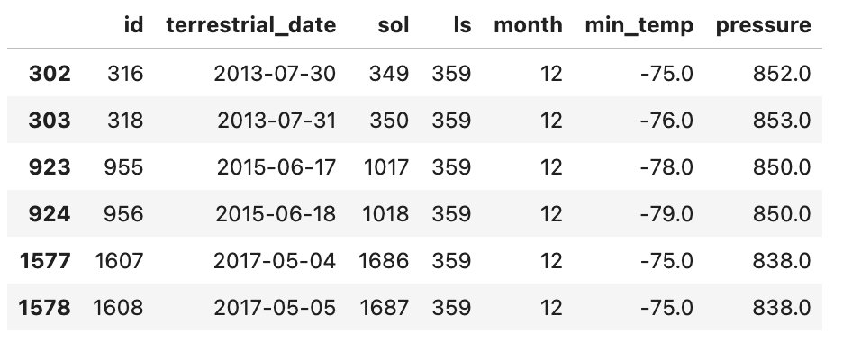

# Mission-to-Mars

# **Purpose**
SpaceFoward, an aerospace company, is anticipating a mission to Mars and requires information to prepare for this endeavor. The task is to gather news information and climate data.

## **Goal**
- Scrape titles and preview text from Mars news articles.
- Scrape and analyze Mars weather data, which exists in a table.
- Analyze Results 

## **Resources**
- Resources/ Mars Planet Science Website: https://redplanetscience.com/
- Software: Jupyter Notebook, Visual Studio Code, Python, Pandas, Splinter, Beautiful Soup, WebDriver Manager, Matplotlib, DateTime

## **Results**
The first objective was to gather news information on Mars. This was accomplished by identifying HTML elements on the Mars Planet Science Website and extracting pertinent information via automated browsing with Splinter and HTML parsing with Beautiful Soup. The information was scraped and saved to a list containing news article titles and article summaries. The list was saved to a json file to easily share with colleagues for further analysis.

The second objective was to scrape Mar’s weather data from a table on a website. The needed information was collected and saved into a dataframe called mars_df. The mars_df dataframe was organized and cleaned.  From there, the data was manipulated to analyze the weather of mars:

- First, the average minimum temperatures were calculated from mars_df. The data was graphed to show the minimum and maximum temperatures over the course of months. The minimum temperature occurs in month 3 and has a temperature of -83 degrees. The maximum temperature occurs in month 8 and has a temperature of -68 degrees.

- Next, the average pressure was calculated from the mars_df. The data was graphed to illustrate the minimum and maximum pressure of the course of the months. The minimum pressure occurs in month and has an atmospheric pressure of . The maximum pressure occurs in month and has an atmospheric pressure of .

- The last goal was to use the data to determine how many earth days equivalate to one year on Mars. The Min_Temp column in the Mars_df was graphed over each day of data. The coldest day of the year appears at the top of each peak. To view the graph more clearly, the LS column, or solar longitude was graphed. This represents where Mars is in relation to the sun as it orbits, with 0 marking a full orbit and starting in the original position. So each peak is a Mars year apart from one another. To calculate the amount of terrestrial time that has lapsed, the terrestrial date of peak 1 was subtracted from the terrestrial date of peak 2. This calculated that there are 687 Earth days to one Martian Year. See below for visual references.

